# Rust Creative Application

*Product and architecture specification*

Design proposal 1.0 \| 30 September 2026

Build a desktop application that joins nonlinear video editing, node based compositing, and procedural motion graphics in one project. Rust owns the application model, evaluation, scheduling, and GPU orchestration. Dear ImGui provides the desktop interface beneath an application owned component system.

The central recommendation is three creative authoring systems over one shared execution foundation. Artists work through timelines, direct canvas controls, inspectors, and graphs. Each surface preserves editable intent; the engine compiles that intent into the work needed for a particular frame or audio range.

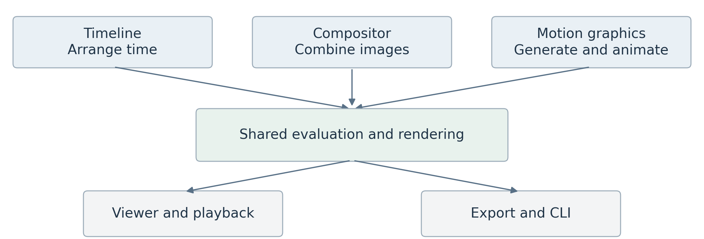

The application in simple form. Each creative package produces work for the same engine.

## The product promise

An editor can assemble footage, open a shot as a composite, add an animated vector title, and return to the sequence without exporting an intermediate movie. A motion designer can begin by drawing and manipulating controls, then reveal the graph when greater precision is useful. A developer can add a feature through documented registrations rather than modifying the shell.

## How to read this document

Sections 2–5 define product scope and platform ownership. Sections 6–13 specify rendering and creative systems. Sections 14–16 define the UI and extension experience. Sections 17–20 provide implementation gates, acceptance criteria, decisions, and source traceability.

Status: a refined proposal, not an implemented system or measured performance claim. Rust and Dear ImGui are user requirements. Other choices are recommendations or explicitly identified experiments. The open source direction follows the supplied modular architecture consultation; the project name, license, and launch operating system remain open.

# 2 Product experience and first release

## Who the first release serves

Prioritize independent editors and motion designers creating short videos, title sequences, explainers, and layered composites. Technical artists are a second audience for reusable procedural tools. Extension authors need a coherent SDK, but a public marketplace is not a prerequisite for a useful editor.

## The reference workflow

1.  Import video, images, and audio into the media browser; inspect metadata and relink unavailable assets.

2.  Assemble a sequence using trims, splits, moves, snapping, basic transitions, and volume automation.

3.  Create a composition from selected clips. Preserve their timing and replace the selection with a document reference in one undoable operation.

4.  Create a vector or text title, repeat its elements, animate them with a wave and falloff, and publish an Energy control.

5.  Place the title in the composite or timeline; preview with audio, save, reopen, and export the same selected range headlessly or from the desktop.

| **Area**        | **First usable release**                                         | **Later expansion**                            |
|-----------------|------------------------------------------------------------------|------------------------------------------------|
| Editing         | Video and audio tracks, trim and split, nesting, undo            | Multicam and advanced interchange              |
| Compositing     | Typed image graph, transform, blur, grade, masks, merge          | Tracking, optical flow, deep compositing       |
| Motion graphics | Paths, shaped text, repeat, fields, instances, controls          | Simulation and advanced topology tools         |
| Scene           | Ordered 2D groups and orthographic rendering                     | Depth tested planes, meshes, extrusion         |
| Delivery        | One verified decode path and export profile, audio, image output | Broader hardware and codec coverage            |
| Platform        | Static packages, recovery, docking, desktop and CLI              | Runtime loading, multiwindow, remote rendering |

Cross-platform is an architectural objective. Choose one reference operating system and GPU before promising a support matrix. Ship only media profiles that pass round-trip tests. Native 2D and a future spatial scene share a model from the start, but full 3D authoring is not required for the first release.

Product success means artists can finish the reference workflow without graph wiring for basic motion design, flattened intermediate files, or loss of editability. Collaboration, general 3D modeling, a full DAW, and arbitrary plugin hot reload are outside the initial scope.

# 3 Modular architecture and ownership

A package is a distributable feature unit. An extension is a capability that package registers. Timeline, compositor, and motion graphics are peer packages; none owns the others. The desktop application assembles their contributions, while the CLI selects only the services and evaluation providers it needs.

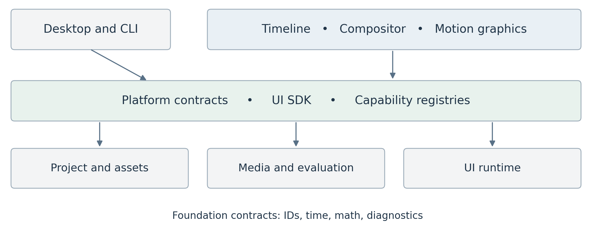

Dependency direction points toward shared contracts and infrastructure. The application binaries wire implementations together.

| **Boundary**        | **Owns**                                                               | **Must not own**                   |
|---------------------|------------------------------------------------------------------------|------------------------------------|
| Foundation          | Stable IDs, exact time, math, diagnostics                              | Clips, nodes, panels               |
| Project core        | Document envelopes, assets, revisions, transactions, persistence       | Feature specific document schemas  |
| Media and execution | Frame types, render IR, audio blocks, scheduling, cache, GPU resources | Timeline or compositor models      |
| Platform contracts  | Commands, capabilities, service interfaces, registrations              | Concrete feature implementations   |
| Creative packages   | Models, commands, compilers, tools, UI contributions                   | Global device or project ownership |
| UI and applications | Components, docking, input, assembly, presentation                     | Authoritative render logic         |

Enforce forbidden imports in CI: project and render cannot import creative packages; timeline, compositor, and motion graphics cannot import each other’s implementation models. Headless builds cannot depend on Dear ImGui. Cross-feature work uses stable references, capability interfaces, and transactions.

Keep the kernel small. Shared animation value types may live in a deliberate contract crate; a motion graphics property stack remains owned by its feature package. A common contract does not require a single universal authoring graph.

# 4 State ownership and editing transactions

Use a single project coordinator as the writer of committed project state. It owns a document store containing type erased, immutable document roots. Each registered document provider supplies validation, serialization, migration, and typed edit handling. Type erasure is an internal host mechanism, not a plugin ABI.

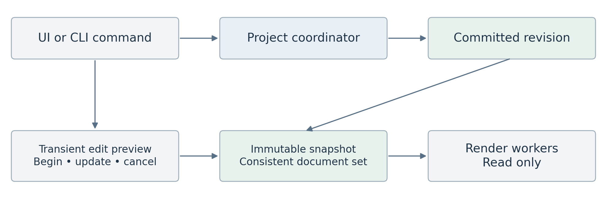

An edit creates a new revision. Workers retain immutable snapshots and never borrow the live editable project.

## Commands and atomic edits

A command describes intent, such as Split Clip. Its handler stages an EditBatch against a base revision. The coordinator validates all affected documents, references, and assets, then publishes them atomically. Failure publishes nothing. Notifications describe the completed change; they do not substitute for the transaction itself.

For a slider or gizmo, begin an edit session, update a transient preview overlay, and commit one batch on release. Cancel discards the overlay. Preview snapshots carry a session generation; they neither enter the persistent undo history nor contaminate committed exports. Autosave captures committed revisions.

## Rust ownership model

Store immutable document and geometry chunks behind Arc and replace only changed chunks. Keep typed arenas inside a package when helpful. Persist stable document and object IDs; use generational handles only for transient in-memory access. Cross-document references never hold concrete package pointers.

Undo stores bounded before/after immutable roots or provider patches in one global history. Cross-feature operations occupy one entry. An open project snapshot resolves every document at the same revision, including nested references. Long-running jobs submit a proposed command with an expected revision; they cannot mutate a document directly.

The UI reads lightweight editor snapshots. Decode, I/O, CPU evaluation, and GPU submission have separate execution domains. Short-lived locks may guard queues and caches; no global project lock is held during rendering, file access, or UI drawing.

# 5 Documents assets and capability contracts

A project contains generic document records, an asset manifest, project settings, and an environment record. Each document envelope stores DocumentId, type ID, package ID, schema version, revision, dependencies, and a payload. The owning package interprets the payload. Project core never serializes concrete Rust type names.

| **Contract**  | **Request or identity**                       | **Result and rule**                                   |
|---------------|-----------------------------------------------|-------------------------------------------------------|
| DocumentRef   | DocumentId and output port ID                 | Stable reference resolved within a project snapshot   |
| VideoSource   | Exact time, resolution, region, quality, view | Render IR fragment and output descriptor              |
| AudioSource   | Sample range and output format                | Audio plan with latency and time mapping              |
| SceneSource   | Time, quality, optional view context          | Immutable evaluated scene or scene plan               |
| AssetResolver | AssetId and expected fingerprint              | Media handle plus metadata or explicit missing status |

These are conceptual contracts, not final Rust signatures. Providers describe duration, available streams, bounds, color interpretation, and supported quality modes. A capability bridge resolves a referenced document and asks its provider to compile the needed output. It does not synchronously render a whole frame inside another render task.

## Nested documents and unavailable packages

Build a dependency closure and reject recursive document references before execution. Validate port types, time mappings, and required capabilities. Missing media or providers remain visible placeholders. Export fails with a precise dependency report unless the user explicitly chooses a substitute; it must never silently omit an effect.

## Persistence and recovery

Start with a versioned archive containing a manifest, independent document payloads, and optional embedded resources. Keep caches and user workspace layouts outside authoritative project content. Write a new archive to a temporary path, flush, and atomically replace using the platform’s supported procedure; retain recovery snapshots and test interrupted writes.

Preserve unknown payload bytes, schema IDs, and declared dependency records during load/save. Do not migrate data without its provider. Never prune resources referenced by unknown payloads; if dependencies cannot be understood, preserve the relevant asset set conservatively. Migrations operate on a copy with rollback.

Record package versions and hashes, renderer versions, asset fingerprints, fonts, color configuration, seeds, and export settings. A lock record explains an environment; restoring it requires the matching binaries and assets. Relinking a changed asset creates a new content identity and invalidates dependent results.

# 6 One shared render and evaluation engine

The renderer answers a demand: produce an output at a given time or over a sample range. Authoring compilers lower timeline edits, compositor nodes, and procedural sources into typed execution plans. The engine owns scheduling and resources; package compilers own the interpretation of creative intent.

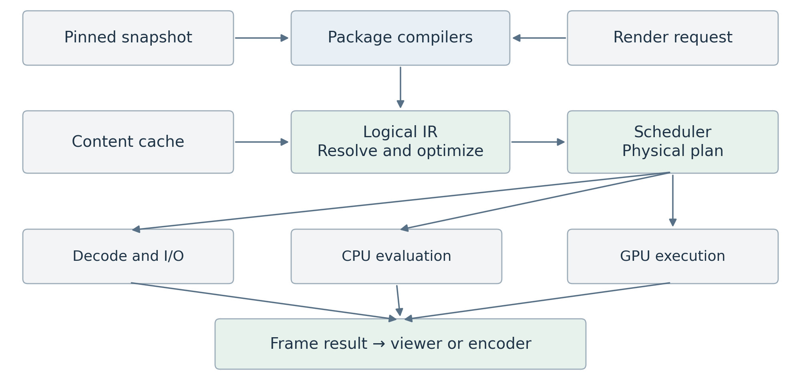

Render demand selects only required dependencies. Video and audio share time and job infrastructure, while retaining separate execution plans.

## Three representations with different jobs

The authoring model is editable and preserves intent. The logical render IR expresses operations, typed inputs, time and region dependencies, and output formats. The physical plan selects CPU work, decoder operations, GPU passes, resource lifetimes, and synchronization. Optimizing the physical plan never rewrites the artist’s graph.

A request carries a snapshot handle, output identity, exact time, resolution, region of interest, view/camera, quality policy, color/output settings, cancellation token, and an optional deadline. Operators declare spatial support, neighboring time samples, determinism class, backend support, and resource estimates.

Validate types and dependency cycles, substitute valid cached results, eliminate dead work, combine compatible transforms, and fuse safe pointwise operations. Do not fuse across blur support, temporal windows, alpha conversions, or color boundaries unless equivalence is established.

Preview and export use the same logical scene and render semantics. They may select different physical plans and explicit quality settings. Export pins a committed snapshot and environment. A full-quality preview can therefore be compared with the pre-encode export image under identical settings.

# 7 Frames color and GPU resource ownership

## A frame is a typed resource

VideoFrame carries dimensions, pixel aspect, plane layout and strides, pixel format and bit depth, timestamp and duration, color metadata, alpha convention, storage location, and readiness. Storage can be CPU planes, an engine GPU texture, or an external decoder surface. Metadata travels with the pixels.

The proposed working image representation is scene-linear floating-point RGB, normally premultiplied RGBA16F. Preserve source primaries, transfer function, matrix, range, and chroma location until input conversion. Keep higher precision available where an operator needs it. Linear light alone is not a complete color-space definition.

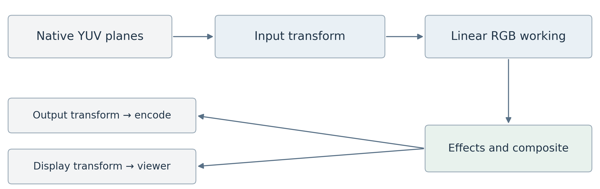

Keep native decoded planes until RGB work is required. Display and export use explicit output transforms.

## Conversions and compositing

Decode YUV into native planes where possible; combine range expansion, chroma reconstruction, transfer decoding, and working-space conversion in a verified GPU pass. Apply artistic operations according to their declared space and alpha semantics. Nonlinear color operations may require safe unpremultiply and repremultiply handling around transparent pixels.

Use an explicit working-space choice and versioned transforms. The first release can limit supported input and output profiles to tested SDR paths while preserving richer metadata. OCIO integration, HDR monitoring, and broader interchange remain expansion work. Never bake the viewer display transform into scene buffers or apply it twice during export.

## GPU ownership and interoperability

Use wgpu as the proposed common GPU layer. One host resource service owns device lifetime, queues, texture pools, pipeline caches, and submission tracking. Pool leases are reusable only after both CPU references and GPU use have completed. A 3840 × 2160 RGBA16F image contains 66,355,200 bytes before allocation overhead, so resource budgets must be explicit.

Hardware surfaces require a tested adapter for format, device identity, ownership, and synchronization. wgpu exposes unsafe backend interoperability, but this does not establish a portable zero-copy codec pipeline \[R3\]. Keep CPU upload/readback as a measured fallback and report copy costs. Device loss invalidates GPU resources and triggers recovery or a clear stopped-render state.

# 8 Scheduling caching and delivery policies

## Schedule for the current user action

Use separate deadline and throughput policies. Audio preparation and the current playback or scrub request get interactive reservations. Thumbnails, waveforms, proxies, and background analysis use bounded queues. Export receives fair throughput and can request a dedicated mode; a fixed priority enum alone must not allow it to starve forever.

A seek increments the request generation. Cancel obsolete queued work, cooperatively stop CPU tasks, and ignore stale presentation results. Already submitted GPU work may finish; cancellation does not imply GPU preemption. Retain a completed result only if its content key still makes it useful.

| **Policy** | **Interactive preview**                        | **Final export**                           |
|------------|------------------------------------------------|--------------------------------------------|
| Deadline   | Present against playback clock                 | Complete every requested output            |
| Quality    | Explicit resolution or proxy policy            | Pinned final settings and original sources |
| Overload   | Reduce resolution or drop video frames visibly | Throttle, spill, or fail clearly           |
| Effects    | Approximation only when disclosed              | No silent bypass or approximation          |
| State      | Latest committed or edit-preview snapshot      | One committed revision and environment     |

## Cache by meaning rather than location

A result key hashes the operator type and implementation version, evaluated parameters, input content identities, exact time and temporal sample set, resolution and region, quality, working color configuration, seed, and view dependency where relevant. Include proxy identity and simulation checkpoint identity when used. Do not use the whole project revision as the only key; unrelated edits should retain reusable results.

Use distinct budgets for compressed packets, decoded frames, geometry, node results, final previews, CPU memory, GPU memory, and disk. Protect in-flight resources, evict unreferenced entries under pressure, and apply backpressure before allocating. Start with full-frame execution; keep region support and effect padding in contracts for later tiling.

## Reproducible delivery

Before export, validate dependencies, fonts, media, color settings, and package availability; pin source fingerprints and refuse a silent source change during rendering. Video encoders and the audio muxer consume ordered outputs from the same time range. Write to a temporary destination and finalize only after success.

Determinism means repeatable evaluation under a pinned environment. GPU floating-point differences can prevent bit-identical output across vendors; image tests use declared tolerances. Procedural seeds, simulation settings, and approved algorithm variants must still be stable.

# 9 Exact time and the audio engine

Use normalized rational time for authoritative project positions and durations, with checked arithmetic and explicit rounding at sample or frame boundaries. Frame rates such as 24000/1001 are exact ratios. Floating-point seconds are convenient inside effects but are not timeline truth. Drop-frame timecode is a display convention, not a different time base.

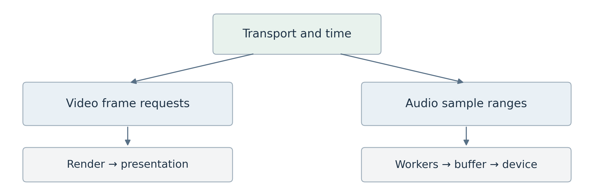

One transport maps project time to video presentation and audio sample ranges. Audio processing is independent of video frame cadence.

## Time mapping

A clip maps sequence time to source time through its offset, in/out range, and speed function. Nested sources compose those mappings. Variable-frame-rate media is addressed by presentation timestamps and duration rather than an assumed frame number. Decoder adapters handle packet order and keyframe seeking behind the media boundary.

Subframe requests support motion blur and procedural sampling. Audio uses integer sample indices at a declared rate with a documented rounding rule when mapping rational time. Define half-open ranges throughout, so adjacent clips and export ranges do not duplicate their boundary frame or sample.

## Audio execution contract

Compile audio separately into decode, resample, automation, gain/pan, effects, mix, and output operations. AudioBuffer carries sample format, channel layout, rate, start time, and length. Effects declare latency; the plan compensates for it. Keep an offline path that evaluates exact sample ranges without a real-time callback.

During playback, use the measured audio device clock when audio is active, adjusted for output latency; otherwise use a monotonic transport clock. Video selects the frame due at that time. Audio workers fill a bounded ring buffer ahead of the callback. The callback does no file I/O, allocation, blocking locks, or graph construction.

On seek, flush or retag stale audio, prime the new range, and resume from an agreed transport position. Underflow emits silence and a diagnostic rather than blocking. Dropped video frames must not stall the audio clock. Measure drift on long and mixed-rate sequences.

First-release audio covers playback, mixing, basic gain/pan, resampling, waveforms, and export. Advanced time stretching and pitch preservation require a separate quality decision. Offline analysis can expose an audio-envelope asset to motion controls, avoiding hidden render-time feedback loops.

# 10 Timeline and compositor behavior

## Timeline authoring

The timeline package owns sequences, tracks, clips, transitions, edit points, and track automation. Clips reference assets or document outputs by ID and declare their time mapping. Video tracks have an explicit stacking order; audio tracks route to buses. Lock, mute, solo, snapping, and selection are command-driven behaviors with distinct project and UI state.

The first tools are select, move, trim, split, insert, lift, and ripple delete. Linked audio/video edits preserve sync unless deliberately unlinked. Transitions define overlap, required source handles, duration, and fallback behavior when handles are insufficient. Every operation validates ranges and participates in the shared undo system.

## Compositor authoring

The compositor package owns an editable graph of typed ports, node instances, connections, groups, and published controls. Initial image operators include Read, Transform, Crop, Blur, Grade, Mask, Merge, and Output. Scalar, color, image, mask, and scene ports are distinct. Unsupported connections fail at edit time with a fixable message.

Nodes declare input regions and time samples through their render operator contracts. A blur expands the required input region; a transform maps output pixels into source coordinates; temporal effects request neighboring times. Stateful feedback is an explicit specialized construct, never an unnoticed cycle.

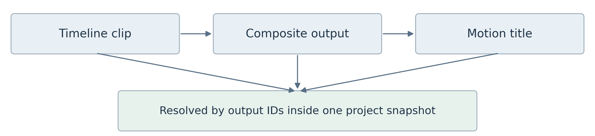

A timeline can consume a composite, and a composite can consume a motion document. Stable output references preserve editability.

## Moving between creative workspaces

Create Composition stages a new document and replaces selected clips with a reference in one transaction. Preserve local timing, transforms, alpha, and audio routing. If the compositor has no audio output, the operation keeps linked audio in the sequence rather than silently discarding it. Define this behavior in the command preview.

Open Source navigates to the referenced document at the mapped local time. A context breadcrumb distinguishes sequence time from source time. Selection and inspector focus follow stable object IDs, so a title remains the same editable object when accessed from the timeline or composite.

Document adapters participate in the shared dependency resolver. A timeline referencing itself through a composite is rejected even if each local graph is otherwise acyclic.

# 11 Procedural motion graphics evaluation

The motion graphics package owns editable constructions, fields, distributions, reusable controls, and scene authoring. It evaluates at an explicit requested time into immutable geometry and scene data. It does not depend on a viewport, Bevy entity IDs, or sequential playback.

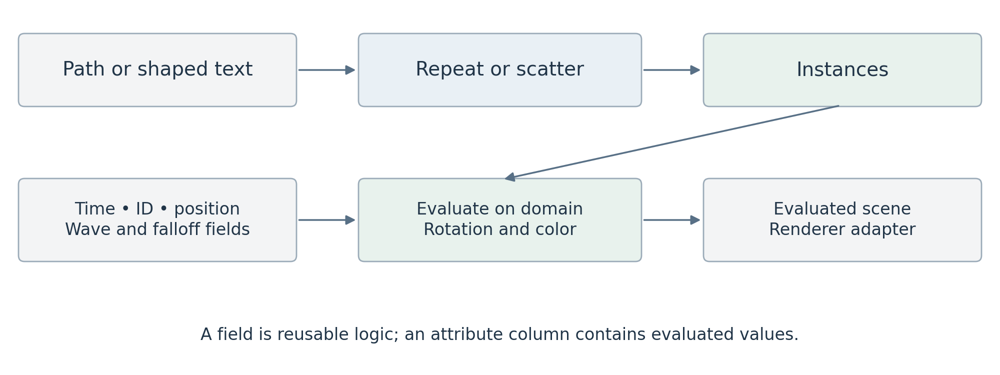

Fields become values only when an operation evaluates them on an element domain. Static geometry remains reusable across changing time samples.

## Geometry and attributes

A GeometrySet holds native paths, shaped text and glyph outlines, point sets, meshes, and instances. Components expose distinct domains: object, point, path control point, spline, glyph, mesh vertex/corner/face, and instance. Store typed attributes in columns; include position, stable element ID, rotation, scale, color, and selection as conventions.

Preserve curves, fill rules, strokes, and text layout until an operation requires tessellation or rasterization. Text shaping produces positioned glyphs with cluster mapping; per-glyph animation must respect ligatures and script shaping. Font identity and fallback decisions are part of the project’s reproducible asset environment.

## Fields and instances

A field is an expression evaluated in a consuming domain: Position, ID, Noise, Distance, or Ramp. A geometry operation changes elements: Scatter, Set Position, Trim Path, or Instance on Points. Capture Attribute freezes evaluated values before later topology changes. Domain conversion uses explicit broadcast, sampling, correspondence, or aggregation rules.

Instance on Points creates references plus transforms and per-instance attributes. Realize Instances explicitly materializes topology only when required. Derive generated IDs from stable source identity and generation rules; topology-changing operators declare when identity cannot be preserved. Random variation uses node ID, element ID, and seed. Current index remains a separate choice for stagger order.

## Evaluation rules

Validate types, units, spaces, and domains; reject accidental cycles; detect static, time-dependent, and view-dependent work. Cache these categories separately. Start with CPU bulk evaluation, then benchmark field fusion and GPU compute. A shared typed expression IR powers field math, bindings, and code snippets; topology writes and neighbor access remain restricted, explicit operations.

# 12 One scene with explicit visual rules

Keep procedural content, scene semantics, and rendering as separate concerns. Native 2D paths live in their local plane; an object transform can place that plane in 3D. Geometry does not become a mesh merely because it is rotated in space. View behavior and visibility rules are separate authored properties.

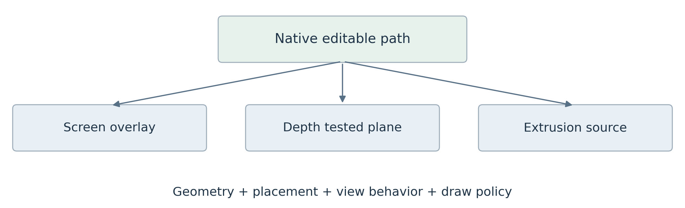

The same editable path can feed several presentations. Its geometry survives changes in placement and rendering.

| **Scene policy**      | **Meaning**                                   | **Boundary rule**                                    |
|-----------------------|-----------------------------------------------|------------------------------------------------------|
| Ordered 2D group      | Paint children in explicit layer order        | Flatten group at defined effect or merge boundary    |
| Spatial group         | Camera projection and depth-tested visibility | Produce linear color, alpha, and optional depth      |
| Overlay group         | Screen-space graphics above a selected result | Apply after the spatial result without depth testing |
| Billboard orientation | Face the active camera                        | Resolve per view without changing source geometry    |

Compose groups in a declared order. Depth from a spatial group describes geometry visibility; a flattened 2D group cannot provide meaningful per-pixel scene depth unless it explicitly defines that contract. A camera-facing plane is not automatically an overlay. Transparent spatial objects need a documented sorting or transparency method.

## Coordinates and effect placement

Proposed convention: path and document coordinates use a top-left origin with X right and Y down in design pixels; spatial coordinates are right-handed with Y up and a camera looking along local negative Z. Explicit transforms map between them. Store design resolution separately from output raster resolution so resizing an export does not rewrite authored positions.

Define object transforms as parent × translation × rotation × scale on column vectors. Screen alignment and billboarding resolve against a named camera/view. Expose local, document, world, and screen space in controls. A geometry deformation happens before projection; an image blur after projection is a distinct operation and cache boundary.

## Renderer adapters

Start with a vector adapter. Evaluate Bevy as a spatial adapter only after the integration tests in Section 17 \[R5\]. Every adapter consumes the same pinned scene and explicit output policy.

# 13 Motion controls and direct authoring

The ordinary motion design workflow begins on the canvas. Draw content, choose a distribution, add a driver, shape its influence, and select a response. The graph reveals the same construction; it is neither a separate copy nor a mandatory first step.

| **Artist concept** | **Question**                     | **Example**                       |
|--------------------|----------------------------------|-----------------------------------|
| Content            | What am I creating?              | Path, shaped text, image, mesh    |
| Distribution       | How many and where?              | Repeat, grid, scatter, along path |
| Driver             | What changes it?                 | Keyframes, wave, noise, Energy    |
| Influence          | Which elements and how strongly? | Radial falloff, range, proximity  |
| Response           | What does it change?             | Position, rotation, color, reveal |

## Property stacks explain the result

Each animatable property has a base value and an ordered stack of contributions. For position, a keyframed offset may add to the base, noise adds at a chosen strength, and a follow target blends toward a target position. The inspector shows the authored base, each contribution, combine mode, weight, and evaluated result.

Dragging an object edits the base by default; an explicit mode edits a selected driver. Position commonly adds offsets, scale multiplies factors, colors interpolate in a declared space, and rotations use explicit quaternion or angle semantics. Keyframing targets a clearly identified stack entry rather than an ambiguous final value.

## Controls and reusable assets

An Energy control can drive rotation and blur through separate bindings. Each binding declares source/destination range, response curve, unit conversion, clamp, strength, and combine mode. Compact bindings can expand into inspectable graph detail. Published controls retain stable IDs across renames; reusable groups carry schema versions and migrate deliberately.

Make scope visible as Whole object, Each copy, Each glyph, or Each path point. A wave uses amplitude, speed, phase, and stagger by current order or distance; a falloff supplies its weight. Overlays reveal order and influence values. Random identity and current ordering must never be conflated.

## Animation and simulation are different contracts

Pure keyframes, expressions, and animated noise must evaluate correctly in any frame order. Stateful simulation lives inside an explicit region with initial conditions, fixed step, checkpoints, invalidation, and bake policy. Directed constraints evaluate in order; mutually dependent constraints require a named iterative solver and convergence policy. Defer simulations until random-access behavior is proven.

The first creative demo is a kinetic title and a radial logo pattern built without opening the graph, then refined through that same graph. This tests whether direct manipulation and procedural depth coexist.

# 14 Desktop UI and workspace layout

Use a single native window with internal docking for the first release. Editing, Compositing, and Motion are workspace presets over the same project and selection model. Color and Audio can initially be panel arrangements rather than separate application modes. Keep multiwindow support behind a later platform gate.

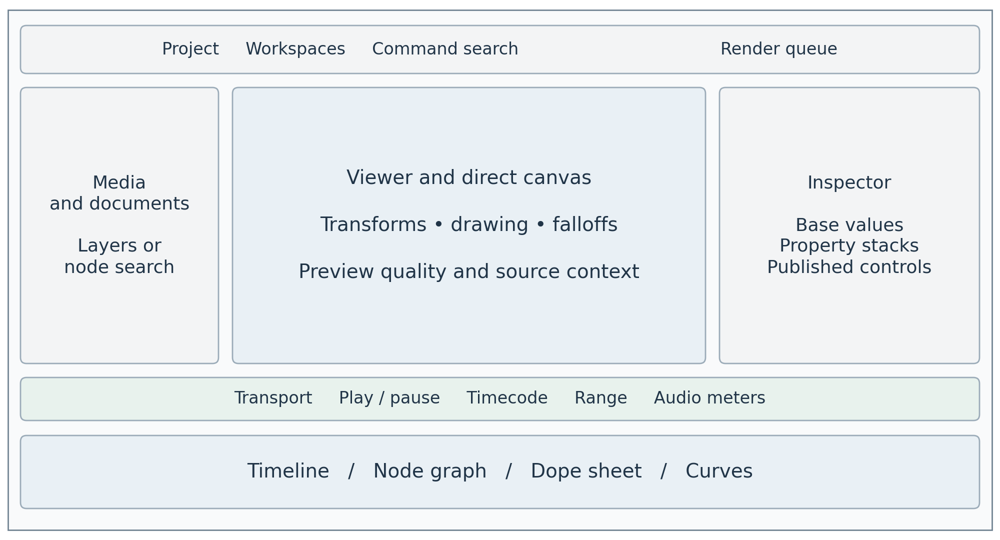

Conceptual workspace, not a final skin. The central editing surface changes while the viewer, inspector, transport, and project remain consistent.

## Navigation and feedback

The top bar exposes project state, workspace, undo/redo, command search, and render queue. The left region holds media, documents, layers, or node search. The central viewer supports direct tools and overlays. The right inspector shows selected objects, property stacks, and published controls. The lower region switches among timeline, graph, dope sheet, and curves.

Selecting an item reveals its editable properties and source context. A breadcrumb shows nested documents and local time. The viewer always identifies draft resolution, proxy use, approximated effects, missing dependencies, and pending work. Stale renders must not appear as current results after a seek.

## Design and interaction requirements

Use restrained semantic colors, predictable spacing, readable type, keyboard navigation, and clear focus. Selection, warnings, keyframes, playhead, and render status must be distinguishable without color alone. Provide remappable commands, numeric alternatives to dragging, DPI scaling, and tested text input/IME behavior.

Dear ImGui does not by itself establish complete assistive-technology support. Treat screen-reader and platform accessibility integration as an explicit feasibility gate, while implementing keyboard and contrast requirements from the beginning. Publish the actual supported behavior.

Virtualize long views and keep I/O, decoding, and rendering off the UI thread. Store layouts separately from project data; tolerate unavailable panels.

# 15 Shared UI components and SDK

Dear ImGui is the low-level interaction and drawing substrate. Application panels and extensions use an application owned immediate-mode UI SDK. Keep the wrapper small enough to stay responsive, but make identity, edit semantics, themes, commands, and property metadata consistent everywhere.

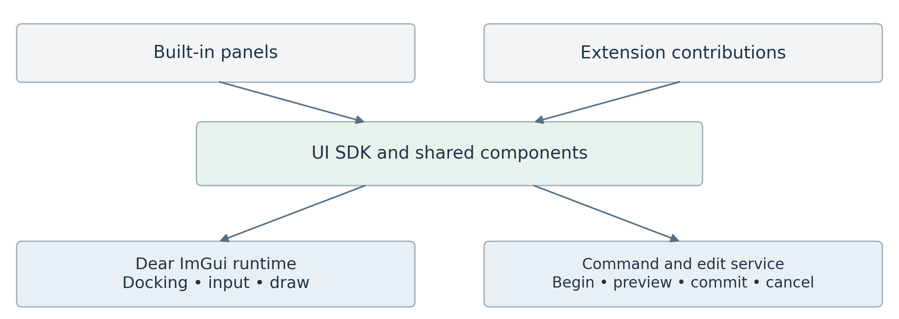

The public UI surface hides backend details. Components return interactions that become commands and edit sessions.

## The central contracts

UiId combines package ID, panel instance ID, object ID, and property path. Labels and memory addresses are not persistent identities. Response reports hover, focus, activation, and clicks. EditResponse adds began, changed, committed, and cancelled, allowing every editable control to participate in the transaction lifecycle.

ParameterSchema defines stable property ID, value type, units, hard and soft limits, default/reset value, interpolation, animation support, expression support, and validation. Most effects receive automatic inspectors. Complex first-party or trusted native panels compose the same immediate-mode controls with custom application components.

Separate project, UI, and ImGui state. A typed UI store holds zoom, search, selection anchors, and edit buffers. Centralize contextual shortcuts and typed drag payloads. The shell owns panel instances and versioned layouts.

| **Component group** | **Shared components**                                            |
|---------------------|------------------------------------------------------------------|
| General             | Buttons, fields, menus, trees, virtual lists, dialogs, search    |
| Properties          | Property rows, colors, transforms, gradients, animation controls |
| Creative editors    | Timeline, node graph, curves, viewer overlays, layer stack       |
| Diagnostics         | Render queue, scopes, logs, profiler, missing-source states      |

Custom drawing belongs inside reusable components. Use semantic theme tokens and icons, not literal colors or font glyphs in each panel. UiTextureId refers to a host texture registry with an explicit lifetime; the viewer receives display-ready images, not unrestricted GPU device access.

Evaluate dear-imgui-rs with compatible winit and wgpu backends \[R1\]. Keep a component gallery and interaction tests across DPI scales. Raw ImGui access is an explicitly unstable, trusted escape hatch.

# 16 Packages execution and compatibility

Built-in packages register through the same contribution model intended for external packages. Keep the first implementation statically linked so boundaries can mature without ABI and runtime loading constraints. A manifest declares package ID, version, host API range, dependencies, contributions, resources, execution needs, and build identity.

| **Contribution**     | **Registration contract**                        | **Execution rule**                  |
|----------------------|--------------------------------------------------|-------------------------------------|
| Document provider    | Schema, serializer, migrator, capabilities       | Typed model stays with its package  |
| Render operator      | Ports, parameter schema, dependencies, backends  | No dialogs or hidden blocking I/O   |
| Panel or editor      | Stable ID, title, instances, workspace placement | UI thread through shared components |
| Command or tool      | ID, arguments, context, availability             | Writes only through transactions    |
| Importer or exporter | Supported formats and options                    | Cancellable jobs with diagnostics   |

## Three stability levels

Internal implementation APIs can change rapidly. Platform APIs between built-in packages change deliberately. Public plugin APIs are smaller, versioned contracts with compatibility tests and documented ownership, threading, error, and cancellation rules. Do not expose internal Rust trait objects as a durable cross-binary interface.

Rust’s native ABI has no stability guarantee \[R2\]. Later native plugins need a narrow versioned C ABI or another deliberately stable boundary, including allocator ownership and error translation. Trusted native code can compromise the host process; a manifest permission list cannot sandbox it.

## Future runtime modes

WASM and helper processes can support isolated operations through handles and serialized messages. They cannot directly receive a borrowed Rust ExtensionUi or host GPU pointer. Use schema-driven controls or a bounded UI description/event protocol across those boundaries. Native immediate-mode panel callbacks remain a separate trusted capability.

Activation resolves dependencies and checks contributions before registration. Disable or unload only after jobs are drained and dependent documents are closed or replaced with preserved placeholders. Hot reload, package repositories, and automatic environment restoration are later work. Restart-based activation is acceptable initially.

Keep media decoders behind adapters. A practical initial codec adapter may use FFmpeg or platform APIs; Rust-owned architecture does not require eliminating FFI. Process isolation can be added for unreliable codecs without changing timeline or render contracts. Shipping codec coverage and distribution obligations require a separate release review.

The headless executable loads project, package, media, and rendering services without panels. The same validation and render request contracts serve desktop export, CLI automation, and tests.

# 17 Implementation plan and technical spikes

Develop vertical slices that exercise creative work and architecture together. Each gate below produces an inspectable result. Dates should follow team capacity and measurements rather than estimates invented before the first prototype.

| **Gate**            | **Build**                                                              | **Exit evidence**                                                                        |
|---------------------|------------------------------------------------------------------------|------------------------------------------------------------------------------------------|
| A Foundation slice  | IDs, rational time, document store, transactions, static registry, CLI | Create, edit, undo, save, reopen, and render a generated image without UI                |
| B Media slice       | One decoder, GPU upload, transform and merge, viewer, cache            | Two sources preview and export through one plan; cancellation and memory traced          |
| C Editing slice     | Timeline, audio transport, inspector, basic composite, nesting         | Complete a short sequence with synced audio and cross-document undo                      |
| D Motion slice      | Paths, text, fields, instances, wave, falloff, controls                | Kinetic title authored directly and edited in its graph; arbitrary-time rendering passes |
| E Product hardening | Recovery, missing packages, migrations, export validation, performance | Reference workflow and acceptance suite pass on declared hardware                        |
| F Expansion         | Spatial adapter, hardware interop, external SDK, advanced effects      | Each feature passes its own contract and compatibility gate                              |

## Resolve risky integrations early

UI spike: create a docked window, render an engine texture, edit a property with one undo entry, test keyboard focus and IME, and exercise 100/150/200 percent DPI. Confirm compatible binding versions and the licensing/availability of optional test tooling. Dear ImGui docking is an upstream feature, but complete application behavior still needs validation \[R4\].

GPU and media spike: measure decode, upload, conversion, compositing, readback, and encode separately. Establish one correct fallback before optimizing hardware interop. Reject an optimization that changes color or synchronization correctness.

Spatial spike: place the same path as an overlay and a depth-tested plane; compare offscreen color, alpha, depth, and instance performance. Test shared-device feasibility and alternative handoff costs before choosing Bevy. The procedural model remains unchanged if that adapter is rejected.

## Initial workspace organization

Start with foundation, project, media, render, platform, ui, timeline, compositor, motion, and app crates. App contains desktop and CLI binaries with feature gating. Keep audio and geometry modules clearly separated within the appropriate crates; split them when independent ownership or compilation boundaries justify it. Separate public contract types from service implementations to prevent dependency cycles.

# 18 Acceptance criteria and measurement

These are proposed release gates, not existing benchmark results. Declare OS, CPU, GPU, RAM, storage, driver, build, media profile, and quality settings for every run. Use both cold and warm cache runs; do not compare proxy playback with original-source export as if they were the same workload.

| **Area**                 | **Required evidence**                                                                                                   |
|--------------------------|-------------------------------------------------------------------------------------------------------------------------|
| Reference workflow       | Import, edit, composite, create title, save/reopen, and export without flattening editable documents                    |
| Undo and persistence     | Cross-document command is atomic; slider drag is one undo entry; cancel restores prior state; interrupted save recovers |
| Unavailable dependencies | Unknown payload bytes survive save/reopen; assets remain preserved; export reports missing requirements                 |
| Temporal correctness     | Mixed-rate and variable-rate sources map correctly; adjacent half-open ranges have no duplicate samples                 |
| Procedural correctness   | Frames requested in shuffled order match sequential evaluation; seeds and element identity behave as declared           |
| Render equivalence       | Full-quality preview and pre-encode export agree under one pinned environment and declared image tolerance              |
| Responsiveness           | Long renders and decodes do not block UI input; stale generations never replace the current viewer                      |
| Resource safety          | Memory and queues stay bounded through repeated seek/edit/export loops; in-flight GPU resources are never reused early  |

## Initial performance targets

On the chosen reference machine, target sustained 1080p30 preview for two supported video layers, basic transforms and compositing, one procedural title, and stereo audio. Target UI frame time below 16.7 ms at the 95th percentile and a warm-cache seek result within 100 ms. These are prototype targets to confirm or revise after Gate B, not minimum hardware claims.

Track dropped video frames, audio underruns, input-to-preview latency, queue depth, cache hit rate, decode and GPU time, transfer bytes, peak CPU/GPU memory, and export throughput. A ten-minute mixed-rate playback test should show no accumulating clock drift; define a measured A/V offset tolerance, initially one output video frame after latency compensation.

## Meaningful test fixtures

Keep tiny reference projects for trim boundaries, fractional frame rates, alpha edges, color ramps, font fallback, blur padding, nested references, missing plugins, and multi-camera view behavior. Compare pixel outputs before encoding using explicit per-test tolerances; separately validate encoded timing and audio duration. Stress OOM, device loss, decoder failure, and cancellation paths.

Ask artists to build a kinetic title and radial pattern without opening the graph. Record completion, points of confusion, and whether they can explain an evaluated property. This validates the proposed interaction model rather than only renderer correctness.

# 19 Design decisions and remaining questions

## Recommendations that reconcile the consultations

| **Topic**                 | **Refined decision**                                                                    | **Reason**                                           |
|---------------------------|-----------------------------------------------------------------------------------------|------------------------------------------------------|
| Backend module layout     | Project core owns envelopes; feature packages own clips and nodes                       | Avoids the feature coupling in the backend sketch    |
| One engine                | Shared scheduling and media contracts with specialized video, audio, and geometry plans | Unifies delivery without forcing one data model      |
| Motion graphics placement | A peer authoring package plus scene capability and renderer adapters                    | Preserves native geometry and headless evaluation    |
| State ownership           | One writer with immutable roots and preview overlays                                    | Resolves edit/render concurrency and global undo     |
| Initial extension system  | Static registrations first; runtime modes later                                         | Tests modularity before ABI and lifecycle complexity |
| GPU optimization          | wgpu baseline with explicit interop and copy fallback                                   | Avoids assuming universal hardware zero-copy         |
| Preview quality           | Disclosed resolution/proxy policies; no silent effect omission                          | Keeps creative intent and delivery predictable       |
| UI extensibility          | Immediate-mode trusted SDK plus schema/protocol boundary                                | Preserves consistency across future isolation modes  |

## Decisions needed before implementation commitments

Choose the first supported OS and reference GPU; the initial media import/export profiles; the working color configuration and supported SDR transforms; the vector/text rendering libraries; and the license/governance model. These choices affect the first binary and release testing, but do not change the proposed ownership boundaries.

Confirm whether basic spatial rendering belongs in the first public release or the next expansion. The recommendation is to prove the scene contract early and ship the 2D workflow first. Decide the public scripting syntax only after the typed expression model works through visual controls.

## Principal risks and responses

Three creative domains can expand scope rapidly: protect the reference workflow and gate additions. Snapshot retention and caches can consume memory: enforce budgets and bounded history. GPU interop and color handling can undermine correctness: keep measured fallbacks and golden fixtures. UI accessibility can limit reach: run a focused feasibility spike and publish supported behavior.

Package versioning alone cannot guarantee restoration: record assets, fonts, configuration, and build identities. A large shared UI library can delay shipping: implement the common property and edit contracts first, then add components as the product needs them.

# 20 Source traceability and technical references

The four supplied consultations are the primary design inputs. This document consolidates their recommendations and adds explicit proposals for ownership, scene contracts, release scope, validation, and recovery. Source labels below refer to the attached files; technical references were checked on 30 September 2026.

| **Input**                              | **Preserved contribution**                                 | **Refinement here**                                                            |
|----------------------------------------|------------------------------------------------------------|--------------------------------------------------------------------------------|
| S1 Rust NLE backend consultation       | Demand rendering, frames, GPU, caching, time, audio        | Separates domain models; bounds memory; clarifies cancellation and determinism |
| S2 Motion graphics engine consultation | Geometry, fields, instances, controls, one 2D/3D scene     | Adds scene output policies, coordinates, text shaping, and integration gates   |
| S3 Modular VFX UI consultation         | Application UI SDK, properties, stable IDs, edit lifecycle | Connects UI edits to transactions and separates remote plugin UI               |
| S4 Modular architecture consultation   | Peer packages, generic documents, services, capabilities   | Chooses writer/snapshot ownership and a concrete vertical build sequence       |

S1 rust_nle_backend_consultation(1).md  
S2 motion_graphics_engine_consultation(1).md  
S3 modular_vfx_ui_consultation(1).md  
S4 rust_nle_vfx_modular_architecture_consultation(1).md

## Primary technical references

[R1 Dear ImGui Rust binding ecosystem](https://github.com/Latias94/dear-imgui-rs)

Confirms the proposed binding/backend families exist; version compatibility remains a prototype check.

[R2 Rust Reference on external blocks](https://doc.rust-lang.org/reference/items/external-blocks.html)

Documents the lack of Rust ABI stability guarantees; supports a separate public binary boundary.

[R3 wgpu Device API](https://docs.rs/wgpu/latest/wgpu/struct.Device.html)

Describes backend-level texture interoperability and its safety requirements; not a codec interoperability guarantee.

[R4 Dear ImGui docking guidance](https://github.com/ocornut/imgui/wiki/Docking)

Documents upstream docking support; application layout and persistence remain host responsibilities.

[R5 Bevy render to texture example](https://bevy.org/examples/3d-rendering/render-to-texture/)

Shows an offscreen rendering mechanism; suitability for the proposed compositor requires the stated spike.

The diagrams express proposed responsibilities and dataflow. They are architectural explanations, not dependency graphs extracted from a repository. All numerical performance targets are proposed acceptance goals; no prototype has been benchmarked as part of this document.
