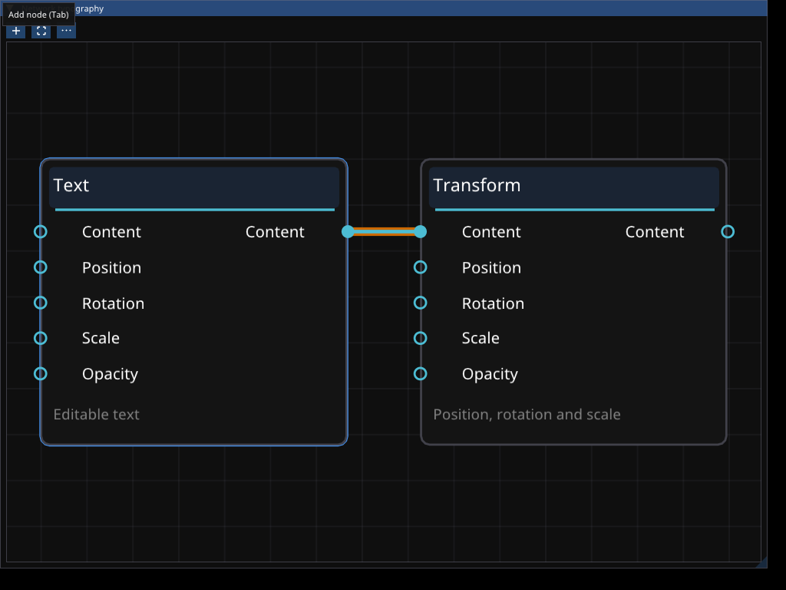
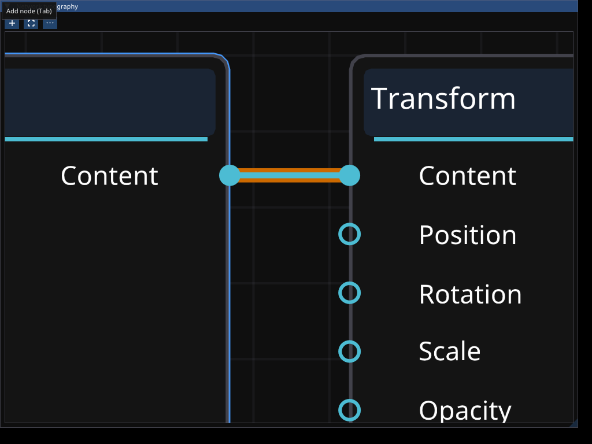

# Phase 32 — Shared typography and readable nodes

Implement application-owned scalable typography and shared graph presentation for
Motion and Compositing. Keep graph semantics, transactions and navigation intact.

- Load one bundled UI family through `fold-ui`; expose body/title/secondary roles
  and a single base size for future appearance settings.
- Compensate for the native node canvas's geometry-only zoom with bounded font
  raster-density tiers. DPI remains the renderer's responsibility. Preserve logical
  text metrics, node layout, clipping, draw order and socket hit testing.
- Use theme-derived node surfaces and neutral labels, distinct headers, restrained
  category accents, and font-relative spacing. Suppress illegible secondary detail
  at overview zoom without moving sockets or changing node bounds.
- Verify density selection and layout stability, shared graph interaction tests,
  affected crate checks, and rendered normal/narrow graph fixtures across zoom and
  DPI. Record unverified native behavior explicitly.

Acceptance: readable normal/close graph text, bounded atlas growth during zoom,
shared styling with no feature-specific rendering forks, and unchanged graph
interaction/undo behavior. Future preferences UI/persistence is outside this slice.

## Evidence

Implemented in shared `fold-ui` typography and graph canvas code. The host owns
one context-bound font set and supplies it to registered panels and subsequently
created editor instances. Feature packages retain graph models and transactions.
The source font and OFL license now live in `resources/fonts/`; their existing
Motion resource identity and SHA-256 are unchanged.

Dear ImGui's dynamic atlas loads glyphs as needed. Seven density tiers (1, 1.5, 2,
3, 4, 6, 8) cover the native graph zoom range without baking a new size for every
scroll delta. Each tier preserves logical advances. The native `GetCurrentZoom`
returns inverse scale, so density/detail selection uses measured canvas-to-screen
magnification instead. Role scopes use `push_font_with_size`; both text measurement
and drawing see the same rounded font size, UI scale, and framebuffer density.
No unsafe drawing code, custom text renderer, or dependency fork was added.

Bodies are opaque theme surfaces. Headers and grid derive from theme colors;
labels use normal/secondary text colors and type colors remain on sockets/wires.
Overview thresholds are in logical screen pixels: port labels disappear below
8px body size and summaries below 11px. Titles persist longer. Hidden labels still
reserve their original bounds. Socket hit regions include the visible boundary
circles and adjacent labels; background-pan exclusion includes protruding sockets.
A later native pivot-alignment call previously overwrote explicit socket centers;
removing it makes the native wire and Fold's hit-test curve use the same endpoints.

Reviewed real-backend captures:

### Verification

- `cargo test -p fold-ui graph_canvas -- --test-threads=1`: five interaction/layout
  tests pass (the opt-in rendering test is run separately). Includes selection,
  wire picking, fractional zoom, pan, drag/commit/cancel and stable native IDs.
- `cargo test -p fold-ui typography::tests -- --test-threads=1`: the density
  selection test passes across 800 fractional zoom samples.
- `cargo test -p fold-ui graph_typography_renders -- --ignored --test-threads=1 --nocapture`:
  passes using dear-imgui-wgpu on **Vulkan llvmpipe / LLVM 20.1.2 / Mesa 26.1.6**.
  Checks the font actually bound by GraphCanvas against its screen transform,
  equal logical text metrics across density tiers, higher-resolution glyph
  allocation, and visible label pixels at normal/close zoom. Produces PPM captures
  in `/tmp/fold-node-ui/` for normal, close, overview, narrow, larger text and DPI.
  Visually reviewed all six; normal/close graph scale is approximately 1.87/4.10,
  overview 0.50, narrow 0.69, 150% UI 1.28, and 2× framebuffer DPI 0.92.
- `cargo test -p fold-motion -p fold-compositor --features fold-motion/ui,fold-compositor/ui --lib ui::tests -- --test-threads=1`:
  eight tests pass, including normal/narrow presentation without project mutation
  and atomic edits/undo. Presentation fixtures use the installed application font.
- `cargo check -p fold-app --features desktop --bin fold-desktop`: passes.
- Touched Rust files formatted; diff reviewed for duplication, unrelated changes,
  stale resource references and whitespace errors.

### Limits and follow-ups

- Desktop automation was unavailable: `orca-ide` could not connect to its runtime,
  and its startup attempt timed out. Captures use the actual offscreen rendering
  backend, not an interactive Fold window. NVIDIA/GTX 1070, monitor transitions and
  live OS input remain unverified. No release executable was rebuilt or relaunched.
- Future appearance preferences should drive the shared base size/UI scale and
  theme. Settings controls/persistence, font-family replacement, localization
  fallback and broader application-wide typography migration are not implemented.
- Existing authored node origins remain unchanged when text settings enlarge nodes;
  Arrange remains the explicit way to lay out a crowded graph again.
- Full workspace suites and Clippy remain deferred to the integration checkpoint.
